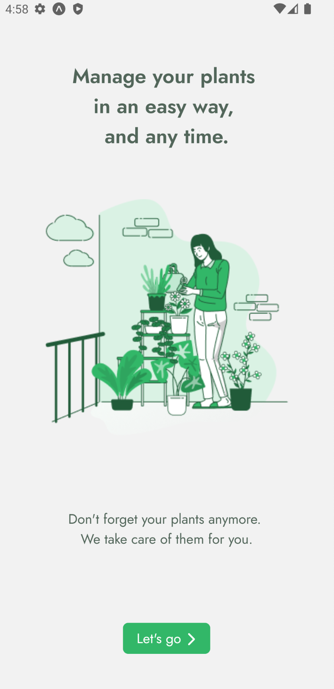
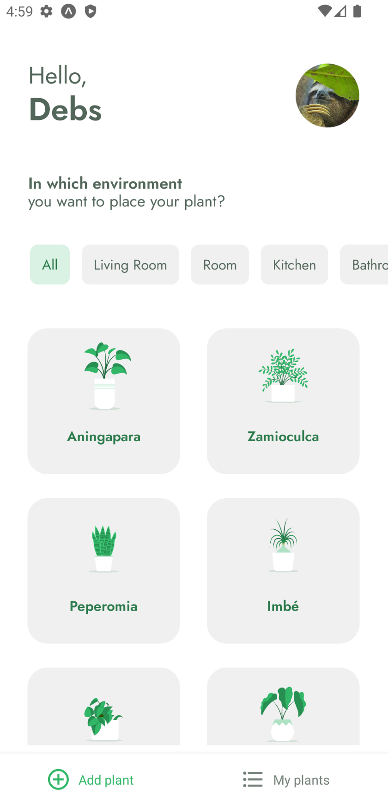
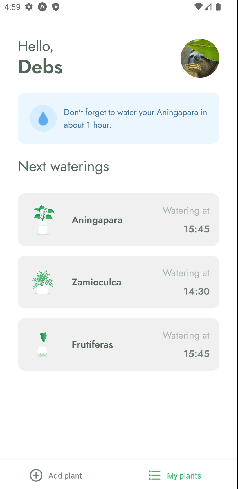

<p align="center">
   
</p>

<h1 align="center">
    
    
    
</h1>

<p align="center">
 🌱 An easy way to take care of your plants.
  <br>
</p>

---

## :rocket: Technologies
This project was made using the following technologies:

* [TypeScript](https://www.typescriptlang.org/)      
* [React Native](https://reactnative.dev/)      
* [Expo](https://expo.dev/)


## :computer: How to run: client

```bash
# Clone repository
$ git clone https://github.com/debfdias/PlantCare/

# Access folder 
$ cd PlantCare
```

```bash
# Install dependencies
$ yarn

# Run expo for android emulator
$ expo start --android

# Run expo for iOS emulator
$ expo start --ios

```
<br>

## 🛠️ How to run: server

```bash
# Open another terminal window

# Run
$ yarn server

# Access fake API 
# http://localhost:3333/
```


## :page_facing_up: License

This project is licensed under the [MIT license](./LICENSE).
